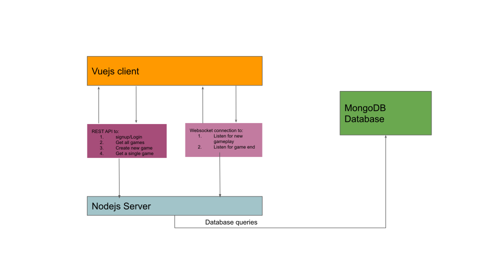

### Overview
The basic overview of the problem can be seen as: "an app where I can create a new group, play with friends and see who the winner is! Oh, and it should be real-time!". The game should only end when 20 questions has been asked by their opponent or when their opponent guess the word correctly.

The above breakdown of the task allows us breakdown the solution to this task into little "requirements" we then start implementing. These are:
 - A person should be able to signup and log in.
 - A person should be able to create a new game
 - A person should be able to invite friends to come play their game
 - They should be able to invite their friends to come and play (they shouldn't be able to invite themself of course)
 - They should be play with their opponent in real time
 - The game winner calculating logic should apply and game should end as expected. When the game ends, then both parties should be aware of this.

 The solution in this project takes all the above into account and the implementation fulfills all.

### Stack
Following the requirement of the test, the backend uses Nodejs and the frontend is in Vue.js. The full breakdown is given below:
- Server:
  - Expressjs
  - Mocha/Chai
  - Supertest (for making test API calls)
  - MongoDB
  - Socket.io

- Client:
  - Tailwindcss
  - Socket.io-client


## Architecture
A diagram showing the architecture of the app is show below


A regular REST API is used for anything that does not require real-time communication. Socket.io is used for real-time communication.

### Engineering tradeoffs
In order to prevent complexity in the code, some decisions were taken and a few things weren't done. They do not affect the core requirements of the app. These tradeoffs are broken into two categories - client and server.

Server tradeoffs are:
 - There's only one test case for the websocket test. Please check the code comment to understand why.

Client tradeoffs are:
 - There are no notifications. For example, ideally when someone accepts the game invite, the host should be notified.
 - If you create a game and nobody accepted the invite, that game won't show up on the list of games in the home page. This is because I wanted to avoid creating another view/component to handle that. Again, keeping it lean.
 - Hardcoded config values. This is because the project is meant to be run as one.
 - No client unit tests.


### Running the project
The following commands assumes you're working from the root folder of the who app. To run the app using docker:
```bash
docker-compose build && docker-compose up
```
To run the client individually:
```bash
cd client && yarn install && yarn serve
```

To run the server individually:
```bash
cd server && yarn install && yarn start
```
In order to run the tests for the server:
```bash
cd server && yarn install && yarn test
```